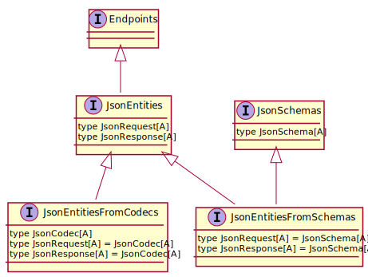

# JSON Entities

The @ref[`Endpoints`](endpoints.md) algebra does not provide support for describing
requests and responses containing JSON entities. The reason for this is that there
are different algebra modules to use depending on your needs.

The following diagram summarizes which algebra to use in which case:

The first question to ask is “do I want to publish documentation of my
endpoints?”. In order to document the JSON entities of your requests and
responses you need a JSON schema for them, that’s why you have to use the
`JsonEntitiesFromSchemas` algebra. See @ref[below](#jsonentitiesfromschemas) for more details.

In case you don’t need to document the schema of your JSON entities, the
second question to ask is “do I implement both a client and a server?”.
If this is the case, then you need to be able to both encode and decode
each JSON entity (an entity encoded by the server will be decoded by the
client, and _vice versa_). To ensure that encoders and decoders are consistent
together both have to be provided at the definition site of your endpoints, that’s
why you should use the `JsonEntitiesFromCodecs` algebra. See
@ref[below](#jsonentitiesfromcodecs) for more details.

Last, if you answered “no” to both questions, it means that your endpoints will only
be served by your server and you don’t need an (abstract) algebra to describe them:
you can directly use the `JsonEntitiesFromEncodersAndDecoders` interpreter for your
specific server. With this module, you will have to provide an encoder for JSON
responses, and a decoder for JSON requests.

@@@note
Note that in a same service some endpoints might fall in a category, while some
other endpoints might fall in a different category. For instance, if you want
to publish an OpenAPI descriptor for your service, the endpoints to include
in the documentation should be defined with the `JsonEntitiesFromSchemas`
algebra, but the endpoint that serves the OpenAPI document itself will be defined
with a `JsonEntitiesFromEncodersAndDecoders` module. See the
@ref[OpenAPI interpreter](../interpreters/openapi.md) documentation for an example.
@@@

The next section introduces general information about the `JsonEntities` hierarchy,
and the remaining sections provide more details on how to use `JsonEntitiesFromSchemas`
and `JsonEntitiesFromCodecs`.

## The `JsonEntities` algebras

@coordinates[algebra]

@scaladoc[API documentation](endpoints4s.algebra.JsonEntities)

The following diagram shows the relations between the three aforementioned algebras,
`JsonEntities`, `JsonEntitiesFromCodecs`, and `JsonEntitiesFromSchemas`, and their
relations with the other algebras:

The `JsonEntities` algebra adds to the `Endpoints` algebra the capability to describe
JSON entities in requests and responses. The `JsonEntitiesFromCodecs` algebra refines
the `JsonEntities` algebra by aligning the request and response entities to the same
`JsonCodec` type. Finally, the `JsonEntitiesFromSchemas` algebra refines the `JsonEntities`
algebra by aligning the request and response entities to the same `JsonSchema` type.

The `JsonEntities` module (and its specializations) enriches the `Endpoints` algebra
with new constructors for request and response entities. For instance, here is how to
define an endpoint taking in its request entity a JSON document
for creating an user, and returning in its response entity the
created user:

@@snip [JsonEntitiesDocs.scala](/algebras/algebra/src/test/scala/endpoints4s/algebra/JsonEntitiesDocs.scala) { #json-entities }

The `jsonRequest[A]` constructor defines a JSON request entity containing
a value of type `A`, provided that there exists an implicit `JsonRequest[A]`
instance. Similarly, the `jsonResponse[A]` constructor defines a JSON
response entity containing a value of type `A` provided that there exists an
implicit `JsonResponse[A]` instance.

The `JsonRequest[A]` and `JsonResponse[A]` types are kept abstract in the
`JsonEntities` algebra. They mean that a value of type `A` can be serialized in a
JSON request or a JSON response, respectively.

The various specializations of the `JsonEntities` algebra refine the `JsonRequest[A]`
and `JsonResponse[A]` types.

The `JsonEntitiesFromSchemas` algebra fixes both types to the same `JsonSchema[A]`
type, which comes from the @ref[`JsonSchemas`](json-schemas.md) algebra (see
@ref[below](#jsonentitiesfromschemas) for more details).

The `JsonEntitiesFromCodecs` algebra fixes both types to a same `JsonCodec[A]` type,
which can refer to Circe’s codec or Play JSON’s codecs according to the variant of
`JsonEntitiesFromCodecs` that you use (see @ref[below](#jsonentitiesfromcodecs) for more
details).

Documentation interpreters fix both types to be a JSON schema for `A`.

Last, the `JsonEntitiesFromEncodersAndDecoders` server interpreters fix the
`JsonRequest[A]` type to a JSON decoder for `A`, and the `JsonResponse[A]`
type to a JSON encoder for `A`.

## `JsonEntitiesFromSchemas`

@coordinates[algebra]

@scaladoc[API documentation](endpoints4s.algebra.JsonEntitiesFromSchemas)

This algebra merges the `JsonEntities` algebra and the
@ref[`JsonSchemas` algebra](json-schemas.md) and aligns both the
`JsonRequest[A]` and `JsonResponse[A]` types to be `JsonCodec[A]`, which is itself
defined to the `JsonSchema[A]` type provided by the `JsonSchemas` algebra:

@@snip [JsonEntities.scala](/algebras/algebra/src/main/scala/endpoints4s/algebra/JsonEntities.scala) { #type-carrier }

This means that you have to define such a `JsonSchema[A]` implicit value (as explained in
the `JsonSchemas` documentation) for each type `A` that you want to carry as a JSON entity.

These schemas can then be interpreted as documentation (by applying the `endpoints4s.openapi.JsonEntitiesFromSchemas`
interpreter), or codecs (by applying a corresponding interpreter for your client or server, e.g.
`endpoints4s.akkahttp.server.JsonEntitiesFromSchemas` to use an Akka HTTP server).

## `JsonEntitiesFromCodecs`

@coordinates[algebra]

@scaladoc[API documentation](endpoints4s.algebra.JsonEntitiesFromCodecs)

In case you don’t need to document the JSON schemas of your request and response entities, the
`JsonEntitiesFromCodecs` family of algebras is the preferred approach. These algebras fix both
the `JsonRequest` and `JsonResponse` types to a same (abstract) `JsonCodec` type:

@@snip [JsonEntities.scala](/algebras/algebra/src/main/scala/endpoints4s/algebra/JsonEntities.scala) { #json-codec-type }

By using the same codec type for both types ensures that the encoding and decoding
are consistent.

Generally, you want to use a `JsonEntitiesFromCodecs` algebra that fixes this `JsonCodec` type to
a concrete type. An example is @scaladoc[`endpoints4s.algebra.playjson.JsonEntitiesFromCodecs`](endpoints4s.algebra.playjson.JsonEntitiesFromCodecs),
which aligns the `JsonCodec` type with Play’s `Format` type:

@@snip [JsonEntitiesFromCodecs.scala](/algebras/algebra-playjson/src/main/scala/endpoints4s/algebra/playjson/JsonEntitiesFromCodecs.scala) { #type-carrier }

The Circe analogous is @scaladoc[`endpoints4s.algebra.circe.JsonEntitiesFromCodecs`](endpoints4s.algebra.circe.JsonEntitiesFromCodecs).

These algebras are provided by the following artifacts:

@coordinates[algebra-circe] @coordinates[algebra-playjson]

To interpret endpoints defined with such algebras, apply any interpreter named
`JsonEntitiesFromCodecs` that matches your
@ref[family](../algebras-and-interpreters.md#interpreters) of interpreters. For instance,
if you use interpreters from the `endpoints4s.xhr` package (ie. the Scala.js web
interpreters), you should use the `endpoints4s.xhr.JsonEntitiesFromCodecs` interpreter.
